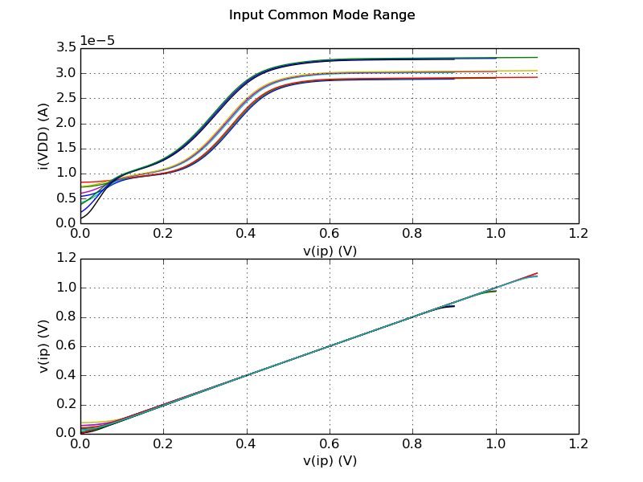
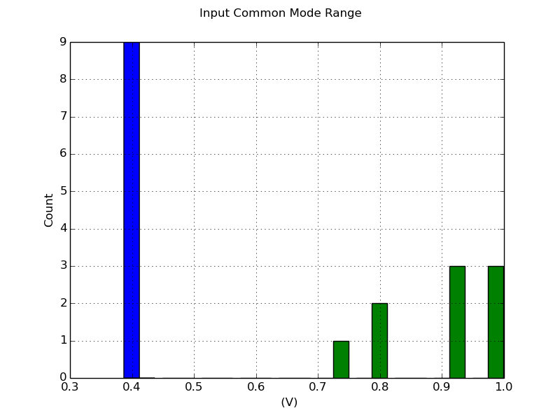

# Testbench Results for `cmos_fig24p2`

##Measurements 
| Measurement | Min. | Avg. | Max. | Unit |
| --- | --- | --- | --- | --- |
| Input Common Mode Minimum | 0.381 | 0.403 | 0.423 | V |
| Input Common Mode Maximum | 0.747 | 0.882 | 1.01 | V |

##Plots

### Input Common Mode Range

##Distributions

### Input Common Mode Range

