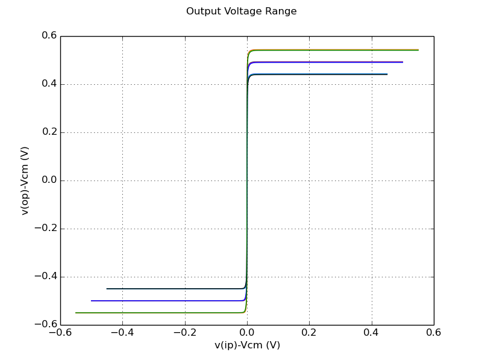
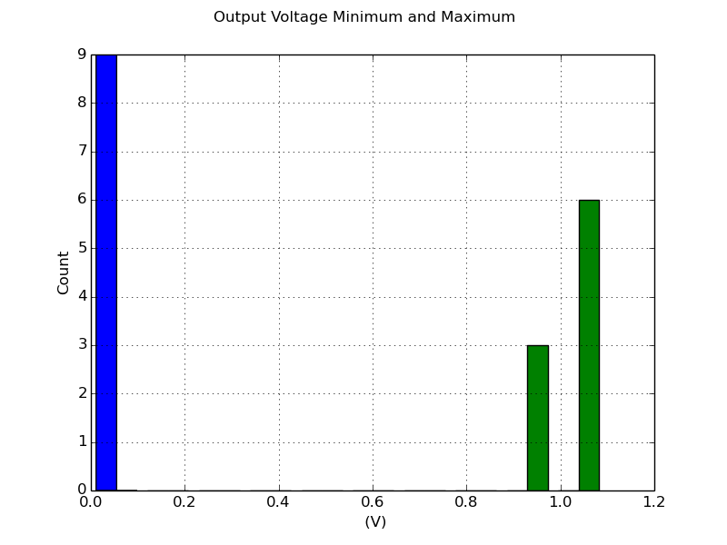

# Testbench Results for `cmos_fig24p2`

##Measurements 
| Measurement | Min. | Avg. | Max. | Unit |
| --- | --- | --- | --- | --- |
| Minimum Output Voltage | 0.000185 | 0.000337 | 0.000554 | V |
| Maximum Output Voltage | 0.89 | 0.992 | 1.09 | V |

##Plots

### Output Voltage Range

##Distributions

### Output Voltage Minimum and Maximum

