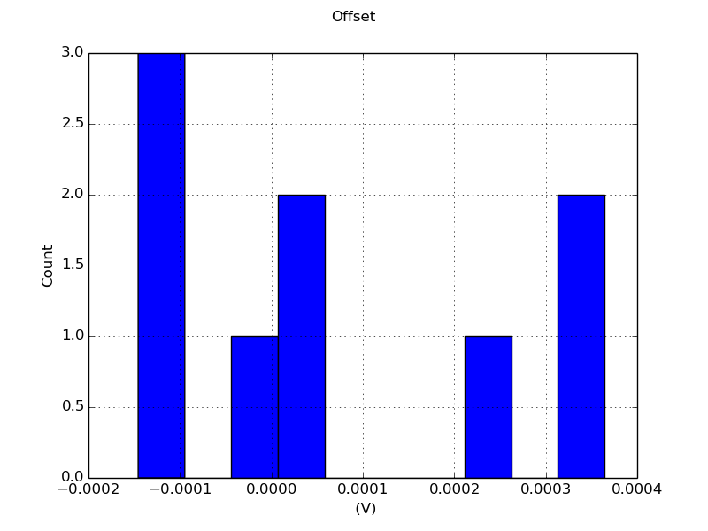

# Testbench Results for `cmos_fig24p2`

##Measurements 
| Measurement | Min. | Avg. | Max. | Unit |
| --- | --- | --- | --- | --- |
| Offset | -0.000146 | 7.12e-05 | 0.000364 | V |
| DC Open-loop Gain | 9.02e+02 | 1e+03 | 1.09e+03 |  |

##Plots

### Offset

##Distributions

### Offset

