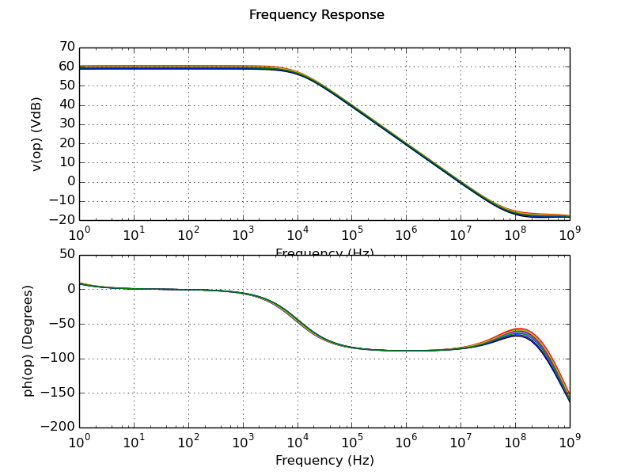

# Testbench Results for `cmos_fig24p2`

##Measurements 
| Measurement | Min. | Avg. | Max. | Unit |
| --- | --- | --- | --- | --- |
| 3dB Gain Frequency | 9.5e+03 | 1.02e+04 | 1.08e+04 | Hz |
| Unity Gain Frequency | 9.25e+06 | 9.79e+06 | 1.04e+07 | Hz |
| DC Gain | 58.7 | 59.6 | 60.5 | dBV |
| Phase Margin | 93.6 | 94.7 | 95.9 | deg |

##Plots

### Frequency Response

##Distributions
